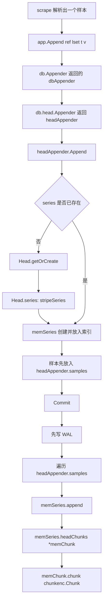

## Prometheus 写入流程：指标如何进入 Head

这份文档只讲一条主线：**一个普通 float 指标样本，是怎样从 scrape 结果一路进入 TSDB `Head`，最后落到内存 chunk 里的。**

为了让小白也能跟上，下面不只讲“调用了哪个函数”，还会回答这些问题：

- **样本先到哪里？**
- **它先放在哪个结构体、哪个字段里？**
- **什么时候才算真正进入 `Head`？**
- **最后具体存在哪里？**

本文主要基于这些代码位置：

- `scrape/scrape.go`
- `tsdb/db.go`
- `tsdb/head_append.go`
- `tsdb/head.go`

---

## 先说结论：样本真正进入 Head 之前，会先停在 appender 的缓冲区里

很多人会以为调用了 `app.Append(...)`，样本就已经直接写进 `Head` 了。**其实不是。**

对普通 float 样本来说，主路径是这样的：

```text
scrape 解析样本
  -> storage.Appender.Append(...)
  -> tsdb.DB.Appender(...)
  -> tsdb.Head.Appender(...)
  -> headAppender.Append(...)
  -> 先放进 headAppender.samples / headAppender.sampleSeries
  -> Commit()
  -> 先写 WAL
  -> 再写入 memSeries.headChunks.chunk
```

也就是说：

- **`Append()` 阶段**：先放到本次批量写入的暂存区。
- **`Commit()` 阶段**：才真正写入 `Head` 的内存结构。

所以，如果你问“指标先到哪里”，最准确的回答是：

- **先到 `headAppender` 这个批量写入器里**；
- **先放到 `headAppender.samples` 和 `headAppender.sampleSeries` 这两个切片里**；
- **`Commit()` 后才进入 `Head.series` 管理的 `memSeries`，再落到 `memSeries.headChunks.chunk` 里。**

---

## 一张总图先建立整体感觉



---

## 先认识几个最关键的结构体

### `DB`：数据库总入口

在 `tsdb/db.go` 里，`DB` 持有：

```go
head *Head
```

这很重要，因为 `DB.Appender()` 最后会把写入请求交给 `db.head.Appender(...)`。

所以可以先建立一个认识：

- **`DB` 是大门口**
- **`Head` 是内存中的活跃数据区**

---

### `Head`：内存中的“当前写入区”

`tsdb/head.go` 里的 `Head` 有几个和写入最相关的字段：

```go
type Head struct {
    series *stripeSeries
    postings *index.MemPostings
    wal, wbl *wlog.WL
    chunkDiskMapper chunkDiskMapper
    ...
}
```

先只抓住几个最重要的：

- `series *stripeSeries`
  - **这是 Head 里“所有活跃时序”的总管理器**。
  - 你可以理解为：`Head` 里所有 series 都挂在这里。

- `postings *index.MemPostings`
  - **这是倒排索引**。
  - 按 label name / label value 找 series 时要靠它。

- `wal *wlog.WL`
  - **写前日志**。
  - `Commit()` 时会先写 WAL，再写内存。

所以，**样本最终要进入 Head，本质上是要进入 `Head.series` 管理的某个 `memSeries`。**

---

### `stripeSeries`：Head 里所有 series 的总目录

`tsdb/head.go`：

```go
type stripeSeries struct {
    size   int
    series []map[chunks.HeadSeriesRef]*memSeries
    hashes []seriesHashmap
    locks  []stripeLock
    ...
}
```

这几个字段要看懂：

- `series []map[chunks.HeadSeriesRef]*memSeries`
  - **按 series ref 查找 series**。
  - ref 可以理解成 series 的内部编号。

- `hashes []seriesHashmap`
  - **按 labels hash 查找 series**。
  - 当你只有 label 集合，还没有 ref 时，通常先从这里找。

这说明 `Head` 里 series 至少有两种找法：

- 按 ref 找：更快
- 按 labels hash 找：创建或首次定位 series 时常用

---

### `memSeries`：单条时序在内存中的真实载体

`tsdb/head.go`：

```go
type memSeries struct {
    ref  chunks.HeadSeriesRef
    lset labels.Labels
    meta *metadata.Metadata

    mmappedChunks []*mmappedChunk
    headChunks    *memChunk

    lastValue float64
    app chunkenc.Appender
    pendingCommit bool
    ...
}
```

其中最关键的是：

- `ref`
  - 这条 series 的内部 ID。

- `lset`
  - 这条 series 的完整标签集。

- `headChunks *memChunk`
  - **当前还在内存里、可继续追加写入的 chunk 链表头。**
  - 这就是普通新样本最终要落进去的地方。

- `mmappedChunks []*mmappedChunk`
  - 较早的 chunk 被 mmap 后，会放到这里。
  - 它们通常是只读的，不是本次新样本的第一落点。

- `lastValue`
  - 用于判断“同时间戳是不是重复值”。

- `app chunkenc.Appender`
  - 真正往 chunk 编码器里追加样本时会用到它。

一句话概括：

- **`memSeries` 是单条时序的家**
- **新样本最终会住进这个家的 `headChunks.chunk` 里**

---

### `memChunk`：series 当前正在写的 chunk

`tsdb/head.go`：

```go
type memChunk struct {
    chunk            chunkenc.Chunk
    minTime, maxTime int64
    prev             *memChunk
}
```

关键点：

- `chunk chunkenc.Chunk`
  - **真正存样本编码数据的地方。**
  - 这是最终“值被写进去”的位置。

- `minTime, maxTime`
  - 这个 chunk 的时间范围。

- `prev`
  - 指向更早的 chunk，形成链表。

所以最底层真正存放普通 float 样本值的地方，可以简单记成：

```text
Head
  -> series
    -> memSeries
      -> headChunks
        -> chunk
```

---

## 第 1 步：scrape 代码把样本交给 Appender

在 `scrape/scrape.go` 里，解析到一个样本后，最终会调用：

```go
ref, err = app.Append(ref, lset, t, val)
```

这一行的含义非常重要：

- `app`
  - 一个 `storage.Appender`，表示“我要开始往存储里写一批数据了”。

- `ref`
  - series 的引用 ID。
  - 如果之前写过同一条 series，可以复用这个 ref，加速定位。
  - 如果没有，就传 `0`。

- `lset`
  - 当前样本所属的标签集合。

- `t`
  - 时间戳。

- `val`
  - 样本值。

这一步还只是把样本**交给存储层接口**，真正具体怎么进入 TSDB，要看 `tsdb.DB.Appender()` 返回的实现。

---

## 第 2 步：`DB.Appender()` 把请求转交给 `Head`

`tsdb/db.go`：

```go
func (db *DB) Appender(ctx context.Context) storage.Appender {
    return dbAppender{db: db, Appender: db.head.Appender(ctx)}
}
```

一行一行看：

- `func (db *DB) Appender(ctx context.Context) storage.Appender`
  - `DB` 提供一个写入器。

- `return dbAppender{...}`
  - 它没有自己重新实现整套写逻辑。
  - 它只是包了一层 `dbAppender`。

- `Appender: db.head.Appender(ctx)`
  - **真正干活的写入器来自 `Head`。**

这一步可以理解为：

- `DB` 说：“写入这事，核心还是交给 `Head`。”

---

## 第 3 步：`Head.Appender()` 创建本次批量写入器

`tsdb/head_append.go`：

```go
func (h *Head) Appender(_ context.Context) storage.Appender {
    h.metrics.activeAppenders.Inc()

    if h.MinTime() == math.MaxInt64 {
        return &initAppender{head: h}
    }
    return h.appender()
}
```

### 逐行解释

- `h.metrics.activeAppenders.Inc()`
  - 当前活跃写入器计数加一。
  - 只是监控指标，不影响样本存储位置。

- `if h.MinTime() == math.MaxInt64`
  - 如果 `Head` 还没初始化时间边界，说明这可能是第一批样本。

- `return &initAppender{head: h}`
  - 第一批样本会先走 `initAppender`。
  - 它的职责很简单：**先用第一个样本的时间初始化 `Head` 的时间范围**。

- `return h.appender()`
  - 正常情况下直接返回真正的 `headAppender`。

所以这里的重点不是“样本存哪”，而是：

- **本次批量写入，会有一个专属的 `headAppender` 对象负责临时收集样本。**

---

## 第 4 步：首次写入时，`initAppender` 先初始化 Head 时间

`tsdb/head_append.go`：

```go
func (a *initAppender) Append(ref storage.SeriesRef, lset labels.Labels, t int64, v float64) (storage.SeriesRef, error) {
    if a.app != nil {
        return a.app.Append(ref, lset, t, v)
    }

    a.head.initTime(t)
    a.app = a.head.appender()
    return a.app.Append(ref, lset, t, v)
}
```

### 逐行解释

- `if a.app != nil { ... }`
  - 如果底层真正的 appender 已经建好了，就直接转发。

- `a.head.initTime(t)`
  - 用第一个样本时间 `t` 初始化 `Head.minTime` / `Head.maxTime`。

- `a.app = a.head.appender()`
  - 真正创建 `headAppender`。

- `return a.app.Append(...)`
  - 然后把这个样本继续交给真正的写入器处理。

注意：

- **`initAppender` 本身不是最终存储位置**。
- 它只是第一批样本进入前的“引导员”。

---

## 第 5 步：`h.appender()` 创建 `headAppender`，它有本次写入的暂存区

`tsdb/head_append.go`：

```go
type headAppender struct {
    head *Head

    series       []record.RefSeries
    samples      []record.RefSample
    sampleSeries []*memSeries

    histograms      []record.RefHistogramSample
    histogramSeries []*memSeries

    metadata       []record.RefMetadata
    metadataSeries []*memSeries
    ...
}
```

这里要特别强调三个字段：

- `samples []record.RefSample`
  - **本次批量写入收集到的 float 样本列表。**

- `sampleSeries []*memSeries`
  - **和 `samples` 一一对应，记录每个样本属于哪个 `memSeries`。**

- `series []record.RefSeries`
  - **本次写入中新创建的 series 列表。**
  - 这些 series 之后要记到 WAL。

所以，**对普通 float 样本来说，第一次真正落脚的字段不是 `Head.headChunks`，而是：**

- `headAppender.samples`
- `headAppender.sampleSeries`

这两个字段就是“提交前暂存区”。

---

## 第 6 步：`headAppender.Append()` 开始接收一个样本

关键函数在 `tsdb/head_append.go`：

```go
func (a *headAppender) Append(ref storage.SeriesRef, lset labels.Labels, t int64, v float64) (storage.SeriesRef, error)
```

下面按执行顺序解释。

### 6.1 先检查时间是否越界

```go
if a.oooTimeWindow == 0 && t < a.minValidTime {
    a.head.metrics.outOfBoundSamples.WithLabelValues(sampleMetricTypeFloat).Inc()
    return 0, storage.ErrOutOfBounds
}
```

意思是：

- 如果没开启 OOO（乱序写入）支持，
- 且时间戳 `t` 比允许写入的最小时间还老，
- 那就直接拒绝。

这一步还没有真正存任何数据。

---

### 6.2 先根据 ref 查 series

```go
s := a.head.series.getByID(chunks.HeadSeriesRef(ref))
```

这句的意思：

- 去 `Head.series` 里找这条 series。
- 找法是通过 ref，也就是 series 内部编号。

如果 `ref` 有效，就会很快找到对应的 `*memSeries`。

此时样本还没进 chunk，只是先定位“该写到哪条时序”。

---

### 6.3 如果 ref 找不到，就按 labels 创建或查找 series

如果 `s == nil`，代码会继续：

```go
lset = lset.WithoutEmpty()
if lset.IsEmpty() {
    return 0, errors.Wrap(ErrInvalidSample, "empty labelset")
}

if l, dup := lset.HasDuplicateLabelNames(); dup {
    return 0, errors.Wrap(ErrInvalidSample, fmt.Sprintf(`label name "%s" is not unique`, l))
}

s, created, err = a.head.getOrCreate(lset.Hash(), lset)
```

意思是：

- 先清理空 label。
- 再检查 label set 是否为空。
- 再检查 label 名是否重复。
- 最后去 `Head.getOrCreate(...)`：
  - 有就拿已有的 `memSeries`
  - 没有就创建新的 `memSeries`

所以，**样本在真正存值前，必须先找到自己的 series 容器。**

---

## 第 7 步：`Head.getOrCreate()` 确保这条 series 在 Head 里有位置

`tsdb/head.go`：

```go
func (h *Head) getOrCreate(hash uint64, lset labels.Labels) (*memSeries, bool, error) {
    s := h.series.getByHash(hash, lset)
    if s != nil {
        return s, false, nil
    }

    id := chunks.HeadSeriesRef(h.lastSeriesID.Inc())
    return h.getOrCreateWithID(id, hash, lset)
}
```

### 逐行解释

- `s := h.series.getByHash(hash, lset)`
  - 先按 label hash 去 `Head.series.hashes` 里找。

- `if s != nil { return s, false, nil }`
  - 找到了就直接返回，不新建。

- `id := chunks.HeadSeriesRef(h.lastSeriesID.Inc())`
  - 找不到就分配一个新的 series ID。

- `return h.getOrCreateWithID(...)`
  - 用这个新 ID 真正创建 series。

所以，新的 series 会在这里拿到自己的 ref。

---

## 第 8 步：`getOrCreateWithID()` 把新 series 挂进 Head 的总目录和索引

`tsdb/head.go`：

```go
func (h *Head) getOrCreateWithID(id chunks.HeadSeriesRef, hash uint64, lset labels.Labels) (*memSeries, bool, error) {
    s, created, err := h.series.getOrSet(hash, lset, func() *memSeries {
        return newMemSeries(lset, id, labels.StableHash(lset), h.secondaryHashFunc(lset), h.opts.ChunkEndTimeVariance, h.opts.IsolationDisabled)
    })
    if err != nil {
        return nil, false, err
    }
    if !created {
        return s, false, nil
    }

    h.metrics.seriesCreated.Inc()
    h.numSeries.Inc()

    h.postings.Add(storage.SeriesRef(id), lset)
    return s, true, nil
}
```

### 逐行解释

- `h.series.getOrSet(...)`
  - 交给 `stripeSeries` 做真正的“查或建”。

- `newMemSeries(...)`
  - 如果需要新建，就创建一个新的 `memSeries`。

- `if !created { return s, false, nil }`
  - 如果并发情况下别人已经先创建了，就直接复用。

- `h.metrics.seriesCreated.Inc()` / `h.numSeries.Inc()`
  - 更新监控和计数。

- `h.postings.Add(storage.SeriesRef(id), lset)`
  - **把新 series 加进倒排索引。**
  - 这样后续查询按 label 才能找到它。

这一步完成后，**series 已经正式进入 `Head` 的目录体系里了**。

但注意：

- 这只是 series 进了 `Head`
- **样本值本身还没真正进 chunk**

---

## 第 9 步：`stripeSeries.getOrSet()` 把 `memSeries` 放进两个索引结构

`tsdb/head.go`：

```go
func (s *stripeSeries) getOrSet(hash uint64, lset labels.Labels, createSeries func() *memSeries) (*memSeries, bool, error)
```

核心动作是两件事：

### 9.1 先放到 `hashes`

```go
s.hashes[i].set(hash, series)
```

这表示：

- 通过 label hash 可以找到这条 `memSeries`

### 9.2 再放到 `series`

```go
s.series[i][series.ref] = series
```

这表示：

- 通过 series ref 也可以找到这条 `memSeries`

所以，**新建 series 之后，真正被挂到了 `Head.series` 里面两个位置：**

- `stripeSeries.hashes[...]`
- `stripeSeries.series[...]`

这是回答“先到哪个结构体哪个字段”的关键部分之一。

---

## 第 10 步：`newMemSeries()` 创建单条时序对象

`tsdb/head.go`：

```go
func newMemSeries(...) *memSeries {
    s := &memSeries{
        lset:                 lset,
        ref:                  id,
        nextAt:               math.MinInt64,
        chunkEndTimeVariance: chunkEndTimeVariance,
        shardHash:            shardHash,
        secondaryHash:        secondaryHash,
    }
    ...
    return s
}
```

注意这里：

- `ref` 和 `lset` 在这里填进去。
- **此时通常还没有真实样本 chunk。**
- 也就是说，新 series 刚创建时：
  - `headChunks` 大概率还是 `nil`
  - 只是 series 容器先存在了

这也很好理解：

- 先建“房子档案”（`memSeries`）
- 再往房子里放第一条样本

---

## 第 11 步：回到 `headAppender.Append()`，先做合法性检查，不直接写 chunk

找到 `memSeries` 后，代码会做：

```go
s.Lock()
_, delta, err := s.appendable(t, v, a.headMaxt, a.minValidTime, a.oooTimeWindow)
if err == nil {
    s.pendingCommit = true
}
s.Unlock()
```

这几行特别关键。

### `s.appendable(...)` 在干什么？

它只是判断：

- 这个样本能不能追加？
- 是顺序写入还是乱序写入？
- 会不会重复？
- 会不会太老？

它**还不是最终写值到 chunk**。

### `s.pendingCommit = true` 在干什么？

表示：

- 这条 `memSeries` 现在有一笔“待提交”的写入。
- 样本已经通过了前置检查，但还在本次 appender 的缓冲里。

---

## 第 12 步：真正的“样本先放哪”——放进 `headAppender.samples`

通过检查后，`headAppender.Append()` 会执行：

```go
a.samples = append(a.samples, record.RefSample{
    Ref: s.ref,
    T:   t,
    V:   v,
})
a.sampleSeries = append(a.sampleSeries, s)
return storage.SeriesRef(s.ref), nil
```

这三行是本文最关键的几行之一。

### 第一行

```go
a.samples = append(a.samples, record.RefSample{...})
```

意思是：

- 把样本的核心信息先追加到 `headAppender.samples`。
- 里面保存的是：
  - `Ref`: 属于哪条 series
  - `T`: 时间戳
  - `V`: 值

### 第二行

```go
a.sampleSeries = append(a.sampleSeries, s)
```

意思是：

- 同时把这个样本对应的 `*memSeries` 也存下来。
- 这样 `Commit()` 时不用重新查一次 series。

### 第三行

```go
return storage.SeriesRef(s.ref), nil
```

返回这条 series 的 ref，给上层复用。

所以到这里，可以非常明确地回答：

## 普通 float 指标样本，在 `Append()` 调用后，先存在哪里？

**先存到：**

- `headAppender.samples []record.RefSample`
- `headAppender.sampleSeries []*memSeries`

**此时还没有真正写进 `memSeries.headChunks.chunk`。**

---

## 第 13 步：`Commit()` 才是真正让样本进入 Head 内存数据结构

`tsdb/head_append.go`：

```go
func (a *headAppender) Commit() (err error)
```

这个函数要分成两段理解：

1. **先写 WAL**
2. **再写入 Head 的内存 series/chunk**

---

## 第 14 步：`Commit()` 先把暂存数据写到 WAL

```go
if err := a.log(); err != nil {
    _ = a.Rollback()
    return errors.Wrap(err, "write to WAL")
}
```

然后看 `a.log()`：

```go
if len(a.series) > 0 {
    rec = enc.Series(a.series, buf)
    if err := a.head.wal.Log(rec); err != nil { ... }
}
if len(a.samples) > 0 {
    rec = enc.Samples(a.samples, buf)
    if err := a.head.wal.Log(rec); err != nil { ... }
}
```

这里的意思是：

- 如果本次有新 series，就把 `a.series` 先写到 WAL。
- 如果本次有样本，就把 `a.samples` 写到 WAL。

这说明：

- **`Append()` 只是把样本放进 appender 的内存缓冲区**
- **`Commit()` 时会先把这些缓冲内容写入 WAL**
- **然后才会把样本写入 `Head` 的内存 chunk**

这一点非常关键。

---

## 第 15 步：`Commit()` 遍历 `a.samples`，把每个样本写入各自的 `memSeries`

`Commit()` 中最核心的一段：

```go
for i, s := range a.samples {
    series = a.sampleSeries[i]
    series.Lock()
    ...
    ok, chunkCreated = series.append(s.T, s.V, a.appendID, appendChunkOpts)
    ...
    series.pendingCommit = false
    series.Unlock()
}
```

一行一行看：

- `for i, s := range a.samples`
  - 遍历本次批量写入收集到的每个样本。

- `series = a.sampleSeries[i]`
  - 拿到这个样本对应的 `*memSeries`。

- `series.Lock()`
  - 锁住这条时序，避免并发写问题。

- `series.append(s.T, s.V, a.appendID, appendChunkOpts)`
  - **真正把样本写进这条 series 的内存 chunk。**

- `series.pendingCommit = false`
  - 提交结束，清除“待提交”状态。

所以：

- **样本从 `headAppender.samples` 搬运到 `memSeries` 的真正动作，发生在 `Commit()` 里的 `series.append(...)`。**

---

## 第 16 步：`memSeries.append()` 真正把值写到 chunk 里

`tsdb/head_append.go`：

```go
func (s *memSeries) append(t int64, v float64, appendID uint64, o chunkOpts) (sampleInOrder, chunkCreated bool) {
    c, sampleInOrder, chunkCreated := s.appendPreprocessor(t, chunkenc.EncXOR, o)
    if !sampleInOrder {
        return sampleInOrder, chunkCreated
    }
    s.app.Append(t, v)

    c.maxTime = t

    s.lastValue = v
    s.lastHistogramValue = nil
    s.lastFloatHistogramValue = nil
    ...
    return true, chunkCreated
}
```

### 一行一行解释

- `c, sampleInOrder, chunkCreated := s.appendPreprocessor(...)`
  - 在真正追加值之前，先确认：
    - 当前有没有 head chunk
    - 要不要切新 chunk
    - 时间顺序是否合法

- `if !sampleInOrder { return ... }`
  - 如果这个样本不适合走顺序写入，就不继续。

- `s.app.Append(t, v)`
  - **这是普通 float 样本真正被追加到底层 chunk 编码器的动作。**

- `c.maxTime = t`
  - 更新当前 chunk 的最大时间。

- `s.lastValue = v`
  - 更新这条 series 的最后一个值，供后续重复样本判断使用。

所以你如果追问“到底是哪一行真的把值写进去了”，最贴近底层的答案就是：

```go
s.app.Append(t, v)
```

但这个 `s.app` 是建立在某个 `memChunk.chunk` 上的 appender，所以还要继续往下看。

---

## 第 17 步：`appendPreprocessor()` 确保当前有可写的 `headChunks`

`tsdb/head_append.go`：

```go
c = s.headChunks

if c == nil {
    c = s.cutNewHeadChunk(t, e, o.chunkRange)
    chunkCreated = true
}
```

这几行很关键。

意思是：

- 先看当前 series 有没有正在写的 head chunk：`s.headChunks`
- 如果没有，就创建一个新的

也就是说：

- **`memSeries.headChunks` 是普通新样本真正准备落入的 chunk 入口。**

如果它还是空，系统会先造一个 chunk 再写。

---

## 第 18 步：`cutNewHeadChunk()` 创建新的 `memChunk` 和底层 `chunk`

`tsdb/head_append.go`：

```go
func (s *memSeries) cutNewHeadChunk(mint int64, e chunkenc.Encoding, chunkRange int64) *memChunk {
    s.headChunks = &memChunk{
        minTime: mint,
        maxTime: math.MinInt64,
        prev:    s.headChunks,
    }

    s.headChunks.chunk, err = chunkenc.NewEmptyChunk(e)
    ...
    app, err := s.headChunks.chunk.Appender()
    ...
    s.app = app
    return s.headChunks
}
```

### 一行一行解释

- `s.headChunks = &memChunk{...}`
  - **创建一个新的 `memChunk`，并挂到 `memSeries.headChunks`。**
  - 从这一刻起，这条 series 有了当前可写 chunk。

- `s.headChunks.chunk, err = chunkenc.NewEmptyChunk(e)`
  - 在这个 `memChunk` 里创建一个空的底层编码 chunk。

- `app, err := s.headChunks.chunk.Appender()`
  - 从底层 chunk 拿到一个写入器。

- `s.app = app`
  - 把这个写入器挂到 `memSeries.app`。

这就是为什么前面 `memSeries.append()` 可以直接：

```go
s.app.Append(t, v)
```

因为这里已经把 `s.app` 绑定到了当前 `headChunks.chunk` 上。

---

## 第 18.5 步：chunk 是怎么切分的？

到这里，你已经知道样本最后会进入 `memSeries.headChunks.chunk`。
但还差一个关键问题：**这个 chunk 什么时候会结束，什么时候会切出下一个新 chunk？**

真正决定这件事的核心函数是：

- `tsdb/head_append.go` 中的 `memSeries.appendPreprocessor()`
- 它里面会在合适的时候调用 `memSeries.cutNewHeadChunk()`

可以把它理解成：

- `appendPreprocessor()`：负责判断“该不该切”
- `cutNewHeadChunk()`：负责真的“切一个新 chunk 出来”

### 18.5.1 先看 chunk 边界怎么定

`cutNewHeadChunk()` 里有一句非常关键：

```go
s.nextAt = rangeForTimestamp(mint, chunkRange)
```

而 `rangeForTimestamp()` 在 `tsdb/db.go` 里是：

```go
func rangeForTimestamp(t, width int64) (maxt int64) {
    return (t/width)*width + width
}
```

这是什么意思？

假设：

- `chunkRange = 2h`
- 当前 chunk 的第一条样本时间 `mint = 10:15`

那么：

- `rangeForTimestamp(10:15, 2h)` 得到的就是 `12:00`

也就是说：

- **一个新 chunk 切出来时，系统先给它一个“最晚必须在什么时候结束”的上界 `nextAt`**
- 这个上界不是随便算的，而是**按 `chunkRange` 对齐到时间边界**

所以你可以先记住：

- **`chunkRange` 决定了 chunk 所属的大时间窗**
- **`nextAt` 是当前 chunk 的理论最晚结束时间**

### 18.5.2 第一条样本一定会切出第一个 chunk

在 `appendPreprocessor()` 里：

```go
c = s.headChunks

if c == nil {
    ...
    c = s.cutNewHeadChunk(t, e, o.chunkRange)
    chunkCreated = true
}
```

意思是：

- 如果这条 series 当前还没有 `headChunks`
- 那么第一条顺序样本进来时，一定先创建一个新的 `memChunk`

所以：

- **每条新 series 的第一个 chunk，就是在这里切出来的**

### 18.5.3 如果样本乱序，就不会往当前 chunk 里顺序追加

`appendPreprocessor()` 里有两处相关判断：

```go
if len(s.mmappedChunks) > 0 && s.mmappedChunks[len(s.mmappedChunks)-1].maxTime >= t {
    return c, false, false
}
```

以及：

```go
if c.maxTime >= t {
    return c, false, chunkCreated
}
```

意思是：

- 如果样本时间戳 `t` 比已经存在的数据更老，
- 它就不是“当前打开的 head chunk 的顺序追加”了。

对普通 in-order 这条主线来说，你可以简单理解为：

- **当前 head chunk 只接收时间单调递增的样本**
- **一旦 `t <= 当前 chunk 的 maxTime`，它就不会作为顺序样本继续塞进这个 chunk**

### 18.5.4 XOR chunk 太大时，会提前切 chunk

在普通 float 样本的 `appendPreprocessor()` 里：

```go
const maxBytesPerXORChunk = chunkenc.MaxBytesPerXORChunk - 19
...
if !chunkCreated && len(c.chunk.Bytes()) > maxBytesPerXORChunk {
    c = s.cutNewHeadChunk(t, e, o.chunkRange)
    chunkCreated = true
}
```

这说明普通 float 使用的 XOR chunk，不只是看时间，还看大小：

- 如果当前 chunk 的字节已经太大
- 那么即使还没到时间边界，也会先切一个新的 chunk

官方代码注释里写得很直白：

- **XOR chunk 有一个按字节大小控制的硬上限目标**
- 由于下一条样本写进去前不知道具体会涨多少字节，所以这里会留一点保守空间

所以这一步的本质是：

- **chunk 不能无限长，太大就先切**

### 18.5.5 编码类型变了，也会切 chunk

```go
if c.chunk.Encoding() != e {
    c = s.cutNewHeadChunk(t, e, o.chunkRange)
    chunkCreated = true
}
```

意思是：

- 当前 chunk 的编码方式和这次追加需要的编码不一致
- 那就不能继续往老 chunk 里写
- 必须切一个新 chunk

对普通 float 主线来说，这种情况没前几个常见，但代码上确实是切 chunk 的原因之一。

### 18.5.6 写到 25% 样本数时，系统会预测一个更合理的结束时间

这是 Prometheus 在 chunk 切分里一个很有意思的点。

在 `appendPreprocessor()` 里：

```go
if numSamples == o.samplesPerChunk/4 {
    maxNextAt := s.nextAt

    s.nextAt = computeChunkEndTime(c.minTime, c.maxTime, maxNextAt, 4)
    s.nextAt = addJitterToChunkEndTime(s.shardHash, c.minTime, s.nextAt, maxNextAt, s.chunkEndTimeVariance)
}
```

先解释 `computeChunkEndTime(...)` 是干什么的：

- 当前 chunk 刚开始时，`s.nextAt` 只是一个按 `chunkRange` 对齐出来的“最晚截止时间”
- 当样本数达到目标值的 25% 时，系统会根据：
  - chunk 的起始时间 `c.minTime`
  - 当前时间 `c.maxTime`
  - 当前采样速度
- **预测一个更合理的结束时间**，希望后续几个 chunk 在这个时间窗里分布得更均匀

然后 `addJitterToChunkEndTime(...)` 会再加一点抖动：

- 不同 series 不会在完全同一时刻一起切 chunk
- 在分布式系统里，相同 series 的抖动又能保持稳定

所以这一步不是立刻切 chunk，而是：

- **先动态重算当前 chunk 的预计结束时间 `nextAt`**

### 18.5.7 真正触发“再切一个新 chunk”的两个硬条件

在普通 float 样本路径里，最终切 chunk 的关键判断是：

```go
if t >= s.nextAt || numSamples >= o.samplesPerChunk*2 {
    c = s.cutNewHeadChunk(t, e, o.chunkRange)
    chunkCreated = true
}
```

这表示当前 chunk 会在两种情况下结束：

- **条件 1：时间到达 `nextAt`**
  - 即已经到当前 chunk 预计的结束时间

- **条件 2：样本数达到 `2 * samplesPerChunk`**
  - 即使时间预测不准，只要样本太多，也强制切 chunk

其中：

- `samplesPerChunk` 默认值在 `tsdb/head.go` 里是 `120`
- 所以普通 float chunk 在样本量维度上，大致是以这个目标做动态调节

你可以把它理解成：

- **Prometheus 切 float chunk，不是单纯按“固定 120 个样本就切”**
- 它是：
  - 先给一个时间边界
  - 中途根据采样速度动态修正
  - 最后再用时间和样本数两个硬条件兜底

### 18.5.8 一句话总结 chunk 切分规则

对普通 float 样本来说，chunk 切分主要由这几类原因触发：

- **当前还没有 chunk，需要先切出第一个 chunk**
- **当前 XOR chunk 太大**
- **编码类型变化**
- **时间到达 `nextAt`**
- **样本数达到 `2 * samplesPerChunk`**

而 `nextAt` 本身又是：

- 初始按 `rangeForTimestamp(mint, chunkRange)` 对齐出来
- 之后在 25% 样本量处通过 `computeChunkEndTime()` 动态修正

---

## 第 18.6 步：block 是怎么切分的？

chunk 是单条 series 内部的数据切分；
**block 则是整个 `Head` 在持久化时，按时间范围切成磁盘块。**

这一层不再是某一条 `memSeries` 自己决定，而是：

- `dbAppender.Commit()` 负责看是否需要触发 compact
- `DB.run()` 后台循环负责真正调度 compact
- `DB.Compact()` / `DB.compactHead()` 负责把 `Head` 某个时间范围切成 block

### 18.6.1 block compaction 的触发点：`dbAppender.Commit()`

`tsdb/db.go`：

```go
func (a dbAppender) Commit() error {
    err := a.Appender.Commit()

    if a.db.head.compactable() {
        select {
        case a.db.compactc <- struct{}{}:
        default:
        }
    }
    return err
}
```

意思是：

- 每次批量写入提交完成后
- 都会检查一次 `a.db.head.compactable()`
- 如果 `Head` 已经达到可 compact 条件，就往 `compactc` 通知一次

所以：

- **block 的切分，不是在单条样本 `Append()` 时发生**
- **而是在一次 `Commit()` 结束后，发现 `Head` 时间范围已经够大时触发**

### 18.6.2 什么叫 “Head 已经可以切 block” ？

`Head.compactable()` 在 `tsdb/head.go`：

```go
func (h *Head) compactable() bool {
    return h.MaxTime()-h.MinTime() > h.chunkRange.Load()/2*3
}
```

源码注释已经把意思写出来了：

- **当 `Head` 的时间跨度超过 `1.5 * chunkRange` 时，就认为它有可 compact 的范围**

也就是：

```text
Head.MaxTime - Head.MinTime > 1.5 * chunkRange
```

为什么不是刚好 `1 * chunkRange` 就切？

源码注释也说了：

- 这里多出来的 `0.5 * chunkRange` 是给 append 窗口留 buffer

你可以把它理解成：

- 前面那一整段时间已经足够“老”，适合封存成 block
- 后面还留半个窗口，避免正在写入的最新数据太容易被卷进去

### 18.6.3 后台线程什么时候真正去 compact？

`DB.run()` 里有两种时机会推进 compact：

- **每分钟定时触发一次**
- **收到 `compactc` 信号时立即尝试一次**

代码里是：

```go
case <-time.After(1 * time.Minute):
    ...
    select {
    case db.compactc <- struct{}{}:
    default:
    }
```

以及：

```go
case <-db.compactc:
    ...
    if db.autoCompact {
        if err := db.Compact(ctx); err != nil { ... }
    }
```

所以 compact 既有：

- **提交后的即时触发**
- 也有：
- **后台定时兜底触发**

### 18.6.4 真正切 block 时，时间范围怎么定？

`DB.Compact()` 里有一段非常关键：

```go
mint := db.head.MinTime()
maxt := rangeForTimestamp(mint, db.head.chunkRange.Load())
rh := NewRangeHeadWithIsolationDisabled(db.head, mint, maxt-1)
```

这里的意思是：

- 本次要从 `Head` 里切出去的 block，起点是当前 `Head.MinTime()`
- 终点不是随便选的，而是：

```go
rangeForTimestamp(mint, chunkRange)
```

结合 `rangeForTimestamp()`：

```go
func rangeForTimestamp(t, width int64) int64 {
    return (t/width)*width + width
}
```

所以可以得到结论：

- **block 的时间边界也是按 `chunkRange` 对齐的**
- 如果 `chunkRange = 2h`，那么 block 边界就是 `00:00、02:00、04:00 ...` 这样对齐出来的

例如：

- `mint = 10:15`
- `chunkRange = 2h`
- 则 `maxt = 12:00`

然后：

- `RangeHead` 读取范围用的是 `[mint, maxt-1]`
- 因为代码注释明确说了：
  - **block 区间是半开区间 `[MinTime, MaxTime)`**
  - **chunk 区间是闭区间 `[minTime, maxTime]`**
- 所以这里减掉 `1ms`，是为了让读取和 block 边界判断一致

### 18.6.5 真正写 block 的动作发生在哪？

`compactHead()`：

```go
uid, err := db.compactor.Write(db.dir, head, head.MinTime(), head.BlockMaxTime(), nil)
```

意思是：

- 把这个 `RangeHead` 写成一个持久化 block
- 写到磁盘目录里

写完之后还会做两件大事：

```go
if err := db.reloadBlocks(); err != nil { ... }
if err = db.head.truncateMemory(head.BlockMaxTime()); err != nil { ... }
```

也就是：

- **先重新加载新 block**
- **再把已经持久化完成的那段 Head 内存截掉**

这一步非常关键，因为它说明：

- block 切出来以后，那段老数据就不再主要待在 `Head` 内存里了
- 它已经变成磁盘 block 的一部分

### 18.6.6 block 切分的第一刀，本质上是“从 Head 左边切走一个对齐时间窗”

把上面几点串起来，可以得到一个非常直观的理解：

- `Head` 一直在右侧接收最新样本
- 当 `Head` 时间跨度太大，超过 `1.5 * chunkRange` 时
- 系统就从 `Head` 的左边，切走一个按 `chunkRange` 对齐的时间窗
- 把这段时间窗写成一个新的持久化 block
- 然后把这段旧数据从内存 `Head` 中截掉

可以画成这样：

```text
Head 当前覆盖时间:
[------ 已经比较老的数据 ------|------ 仍在活跃写入的较新数据 ------]

达到 compact 条件后：
[--- 切出一个 block ---][------ 剩余在 Head 中继续写入 ------]
```

### 18.6.7 再补一句：磁盘上的 block 之后还会继续合并

在 `DB.Compact()` 的最后，还会继续执行：

```go
return db.compactBlocks()
```

而 `compactBlocks()` 会调用：

- `db.compactor.Plan(db.dir)`
- `db.compactor.Compact(db.dir, plan, db.blocks)`

这一步已经不是“Head 第一次切成 block”了，而是：

- **已有磁盘 block 之间的后续分层合并**

所以如果你问“block 怎么切分”，要分两层理解：

- **第一层**：`Head` 按 `chunkRange` 对齐切出初始 block
- **第二层**：磁盘上的多个 block 之后再按 compactor 策略继续合并成更大的 block

### 18.6.8 一句话总结 block 切分规则

- **触发条件**：`Head.MaxTime - Head.MinTime > 1.5 * chunkRange`
- **切分边界**：`[Head.MinTime(), rangeForTimestamp(Head.MinTime(), chunkRange))`
- **执行方式**：把这段 `RangeHead` 写成磁盘 block，然后截掉对应的 Head 内存

---

## 第 19 步：样本最终落点到底是哪儿？

现在可以给出最完整、最精确的答案。

### 19.1 `Append()` 之后，样本的第一落点

在本次批量写入器里：

- `headAppender.samples`
- `headAppender.sampleSeries`

这是**提交前暂存区**。

### 19.2 `Commit()` 期间，样本被写入的最终内存位置

对普通 float 样本，最终链路是：

```text
Head
  -> series *stripeSeries
    -> series/ref 或 hashes/hash 找到 *memSeries
      -> headChunks *memChunk
        -> chunk chunkenc.Chunk
```

如果要用“字段路径”说得更直白一些：

- **样本归属的 series 在** `Head.series`
- **当前正在写的 chunk 在** `memSeries.headChunks`
- **真正编码后的样本字节在** `memSeries.headChunks.chunk`

---

## 第 20 步：再回答一次“指标先到哪里，再到哪里，存在哪儿”

这是本文最核心的归纳版。

### 一个新样本的顺序路径

1. `scrape/scrape.go` 调用：
   - `app.Append(ref, lset, t, val)`

2. `tsdb/db.go`：
   - `DB.Appender()` 返回 `dbAppender`
   - 内部真实写入器来自 `db.head.Appender(ctx)`

3. `tsdb/head_append.go`：
   - `Head.Appender()` 返回 `headAppender`

4. `headAppender.Append()`：
   - 先定位或创建 `*memSeries`
   - 如果是新 series：
     - 进入 `Head.series.hashes[...]`
     - 进入 `Head.series.series[...]`
     - 进入 `Head.postings`

5. `headAppender.Append()` 继续：
   - 样本**先进入**：
     - `headAppender.samples`
     - `headAppender.sampleSeries`

6. `headAppender.Commit()`：
   - 先把 `a.series` / `a.samples` 写入 `WAL`

7. `headAppender.Commit()` 遍历样本：
   - 调 `memSeries.append(...)`

8. `memSeries.append()`：
   - 通过 `appendPreprocessor()` 确保有 `memSeries.headChunks`
   - 必要时通过 `cutNewHeadChunk()` 创建新的 `memChunk`
   - 最后通过 `s.app.Append(t, v)` 把值写入 `memSeries.headChunks.chunk`

### 一句话版

- **先到 `headAppender` 的缓冲字段**
- **提交时进入 `Head` 管理的 `memSeries`**
- **最后存进 `memSeries.headChunks.chunk`**

---

## 容易搞混的几个点

### 1. `Append()` 不等于已经写进 Head chunk

不是。

`Append()` 只是：

- 校验
- 找/建 series
- 把样本放进本次 appender 的缓存切片

真正写入 `memSeries.headChunks.chunk` 发生在 `Commit()`。

### 2. series 创建成功，不等于样本值已经写进去

是的。

新 series 可能已经放进：

- `Head.series.hashes`
- `Head.series.series`
- `Head.postings`

但样本值仍然还在 `headAppender.samples` 里等待 `Commit()`。

### 3. `headChunks` 和 `mmappedChunks` 不一样

- `headChunks`
  - 当前还在内存里继续写的 chunk
  - **新样本主要写这里**

- `mmappedChunks`
  - 早一些的 chunk，被 mmap 管理
  - 更偏向“已封存但还属于 Head 范围”的数据

---

## 给小白的最终记忆口诀

你可以把它记成四层：

```text
样本
  先放进 appender 暂存区
  再进入 Head 的 series 体系
  再进入对应 series 的 head chunk
  最后编码进 chunk 对象里
```

更具体一点：

```text
headAppender.samples
  -> memSeries
  -> memSeries.headChunks
  -> memSeries.headChunks.chunk
```

---

## 如果你只想记住一句话

**Prometheus 普通样本不是在 `Append()` 时直接写进 `Head` chunk，而是先放进 `headAppender.samples`，等 `Commit()` 时再写入 `Head.series` 管理的 `memSeries.headChunks.chunk`。**
